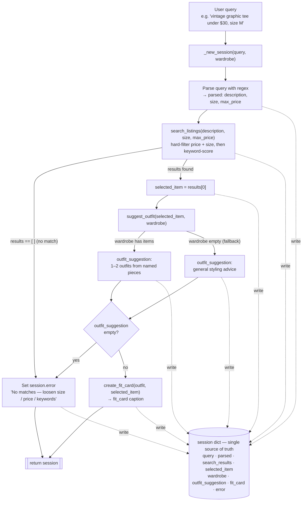

# FitFindr — planning.md

> Complete this document before writing any implementation code.
> Your spec and agent diagram are what you'll use to direct AI tools (Claude, Copilot, etc.) to generate your implementation — the more specific they are, the more useful the generated code will be.
> Your planning.md will be reviewed as part of your submission.
> Update it before starting any stretch features.

---

## Tools

List every tool your agent will use. For each tool, fill in all four fields.
You must have at least 3 tools. The three required tools are listed — add any additional tools below them.

### Tool 1: search_listings

**What it does:**
Searches the 40 mock listings for items matching the user's request. It runs in two stages: first it applies hard filters (price ceiling and size) to drop listings that don't qualify, then it scores the survivors by keyword overlap with the description and returns them ranked best-match first. Pure Python — no LLM call.

**Input parameters:**
- `description` (str): keywords describing the item the user wants (e.g. `"vintage graphic tee"`). Already stripped of price/size by the agent before it reaches this tool.
- `size` (str | None): a size to filter by (e.g. `"M"`, `"small"`, `"US 7"`), or `None` to skip size filtering.
- `max_price` (float | None): an inclusive price ceiling, or `None` to skip price filtering.

**How matching works:**
- **Price filter (hard):** keep a listing only if `price <= max_price`. Skipped if `max_price is None`.
- **Size filter (hard):** keep a listing only if its size matches the request. Matching is normalize → token → wildcard:
  1. *Normalize* the requested size: lowercase, strip, map words to letters (`small`→`s`, `medium`→`m`, `large`→`l`, `extra large`/`x-large`→`xl`).
  2. *Token-match*: split the listing's size on non-alphanumeric characters (so `"S/M"` → `["s","m"]`, `"XL (oversized)"` → `["xl","oversized"]`) and keep the listing if the normalized request equals one of those tokens. (Token-match, not substring, so a request for `S` never matches `XL`/`oversized`/length codes like `L30`.)
  3. *One-size wildcard*: if the listing size contains `one size`, `oversized`, or `adjustable`, it matches any requested size.
  Skipped if `size is None`.
- **Keyword scoring (rank):** on the listings that pass both filters, glue `title` + `style_tags` + `description` into one lowercased text blob. Split the description into words, drop words ≤2 letters, and score each listing by how many of those words appear as a **substring** of its blob (substring so `vintage` matches `vintage-style`). Drop any listing scoring 0.

**What it returns:**
A list of the full matching listing dicts — each with all 11 fields (`id, title, description, category, style_tags, size, condition, price, colors, brand, platform`) — sorted by keyword score, highest first. Ties keep dataset order (stable sort). Returns **all** scoring matches, not a top-N slice; the agent selects `results[0]`.

**What happens if it fails or returns nothing:**
Returns an empty list `[]` — it never raises. The agent checks for the empty list and stops early with a helpful message telling the user what to loosen (size, price, or keywords), rather than calling `suggest_outfit` with no item.

---

### Tool 2: suggest_outfit

**What it does:**
Given the thrifted item the user is considering and their existing wardrobe, asks the LLM to suggest 1–2 complete outfits. It branches on whether the wardrobe has items: with a wardrobe it builds looks around the user's actual named pieces; with an empty wardrobe it falls back to general styling advice for the item. Calls Groq `llama-3.3-70b-versatile` via `_get_groq_client()`.

**Input parameters:**
- `new_item` (dict): a listing dict (the candidate item). Only the styling-relevant fields are fed to the model: `title`, `category`, `colors`, `style_tags`, `description` (price/condition/platform are left out — those belong to the fit card).
- `wardrobe` (dict): a wardrobe dict with an `items` key (a list of item dicts). May be empty.

**How it works:**
- **Format the wardrobe** (when non-empty): include every field except `id` — `name`, `category`, `colors`, `style_tags`, `notes` (omit `notes` when `null`) — laid out **grouped by category** (TOPS / BOTTOMS / SHOES / OUTERWEAR / ACCESSORIES). Grouping hands the model the outfit "slots" so it can see which slot the new item fills and complete the look from the others.
- **Prompt (non-empty wardrobe):** system persona is a sharp, casual thrift stylist. Ask for 1–2 *complete* outfits that (a) reference the user's pieces **by name**, (b) build a full look — the new item fills its category slot, the rest come from the wardrobe, (c) include one concrete styling move per look (cuff the sleeves, tuck the front, layer it open), (d) stay short and casual, plain text (no markdown).
- **Prompt (empty wardrobe):** a different prompt — no pieces to name. Ask for general styling guidance: what kinds of pieces pair well, what vibe/occasions it suits, and 1–2 example looks described generically ("pair with high-waisted denim + white sneakers"). Same casual tone.
- **Temperature ≈ 0.7** — creative but grounded in the actual pieces, so it doesn't invent items the user doesn't own. (The fit card runs hotter; this one stays grounded.)

**What it returns:**
A non-empty styling string with 1–2 outfit ideas (or general advice on the empty-wardrobe path). Plain text, ready to drop into the UI's outfit panel and to pass into `create_fit_card`.

**What happens if it fails or returns nothing:**
- **Empty wardrobe** is not an error — it takes the general-advice branch and still returns a useful string.
- **API failure** (missing key, network, rate limit): the LLM call is wrapped in `try/except` and returns a plain apologetic string ("Couldn't generate outfit ideas right now — try again in a moment") instead of raising, so the agent stays alive. The tool guarantees a non-empty string on every path.

---

### Tool 3: create_fit_card

**What it does:**
Turns an outfit suggestion plus the thrifted item into a short, shareable caption — the kind of thing someone posts with an OOTD/thrift-haul photo. Calls Groq `llama-3.3-70b-versatile` via `_get_groq_client()`, run at a high temperature so the caption sounds different each time. This is where the item's `price` and `platform` finally surface for the user.

**Input parameters:**
- `outfit` (str): the styling string returned by `suggest_outfit()` — carries the look the caption riffs on.
- `new_item` (dict): the listing dict. Only `title`, `price`, `platform` (named once each in the caption per spec) and `style_tags` (to hit the vibe in specific words) are fed to the model; `description`/`colors`/`condition` are left out to keep a 2-sentence caption from getting diluted.

**How it works:**
- **Guard first (the failure mode):** if `outfit` is empty or whitespace-only, return a descriptive error string and **do not call the LLM** (see below).
- **Prompt:** system persona is someone posting their own thrift find — first-person, casual, authentic OOTD energy (lowercase-leaning, an emoji or two is fine), **not** a product description. Feed the item details + the full `outfit` string. Ask for a **2–4 sentence** caption that works in the item name + price + platform **naturally, once each**, and captures the vibe in *specific* terms (not "cute outfit"). Plain text.
- **Temperature ≈ 0.95 (run hot):** variety is a requirement here, not a nice-to-have — the same input should produce noticeably different captions on repeat runs. (Verify in testing; bump higher if outputs repeat.)

**What it returns:**
A 2–4 sentence caption string, ready for the UI's fit-card panel.

**What happens if it fails or returns nothing:**
- **Empty/whitespace `outfit`** (the spec's named failure mode): return a descriptive error string ("Can't make a fit card without an outfit — run suggest_outfit first") without calling the LLM. Never raises.
- **API failure:** the LLM call is wrapped in `try/except` and returns a graceful apologetic string instead of crashing.

---

### Additional Tools (if any)

<!-- Copy the block above for any tools beyond the required three -->

---

## Planning Loop

**How does your agent decide which tool to call next?**

The loop runs the three tools in a set order, but it is **not a blind pipeline** — after each step it inspects what came back and decides whether to continue or stop early. The one decision point that changes behavior is the search result: an empty result terminates the run before any LLM tool is called.

1. **Initialize** a fresh `session` via `_new_session(query, wardrobe)`.
2. **Parse** the raw query into `description`, `size`, `max_price` and store them in `session["parsed"]`. Parsing is **rule-based (regex), not an LLM call**:
   - price from patterns like `under $30` / `$30` / `max 30` → `max_price`
   - size from `size M` / `size 8` patterns or known size tokens → `size`
   - the leftover text, with price/size phrases and a small stop-word list removed, → `description` (clean keywords so Tool 1's substring search doesn't misfire on words like `for` matching `platform`)
   - *Why regex over an LLM parse:* it avoids an extra API call on every query (**lower latency**, no added cost or non-determinism), it's unit-testable, and parsing is explicitly left to us by the stub (`agent.py`). Groq is still required and used where it does the real work — Tools 2 and 3.
3. **Search** — call `search_listings(**session["parsed"])`, store the list in `session["search_results"]`.
   - **Branch (the early exit):** if `search_results` is empty → set `session["error"]` to a helpful message naming what to loosen (size, price, or keywords) and **return the session immediately**. `suggest_outfit` is *not* called with empty input. This is the conditional that makes it a planning loop, not a fixed sequence.
4. **Select** `session["selected_item"] = search_results[0]` — the top-ranked match (Tool 1 already returns them sorted).
5. **Suggest outfit** — call `suggest_outfit(selected_item, session["wardrobe"])`, store the string in `session["outfit_suggestion"]`.
6. **Fit card** — light guard first: if `outfit_suggestion` is empty/falsy, set `session["error"]` and skip; otherwise call `create_fit_card(outfit_suggestion, selected_item)` and store it in `session["fit_card"]`. (Tool 2 guarantees a non-empty string, so this guard rarely fires — it's a second safety net that keeps the loop responsive to what it actually received.)
7. **Done** — return the `session`. The run is "complete" when `fit_card` is set, or "ended early" when `error` is set.

---

## State Management

**How does information from one tool get passed to the next?**

The single `session` dict (created by `_new_session`) is the **one source of truth** for the whole interaction. Every step **reads its inputs from the session and writes its outputs back into it** — nothing is passed around as loose variables and the user is never re-prompted for something a previous step already produced.

- **What's tracked** (the session fields): `query` (raw input), `parsed` (the regex-extracted `description`/`size`/`max_price`), `search_results` (list of matching listing dicts), `selected_item` (the chosen listing, `results[0]`), `wardrobe` (passed in at the start), `outfit_suggestion` (Tool 2's string), `fit_card` (Tool 3's string), and `error` (set if the run ended early).
- **How it flows:** `query` → (parse) → `parsed` → (search) → `search_results` → (select) → `selected_item` → (suggest) → `outfit_suggestion` → (caption) → `fit_card`. Each arrow is one tool reading the previous field and writing the next. The fit-card step is where this is most visible — it reads **both** `selected_item` (from search) and `outfit_suggestion` (from suggest).
- **`error` is the gate:** any step may set it and return early; downstream consumers (`app.py`'s `handle_query`) check `session["error"]` *first*, and when it's set the other output fields remain `None`.
- **Schema stays fixed:** we use the session shape already defined in `agent.py` (and mirrored in `app.py` and the docstrings) rather than inventing new fields, so all three files stay in sync.

---

## Error Handling

For each tool, describe the specific failure mode you're handling and what the agent does in response.

| Tool | Failure mode | Agent response |
|------|-------------|----------------|
| search_listings | No results match the query | Tool returns `[]` (never raises). The planning loop detects the empty list, sets `session["error"]` to a specific message that names what to loosen — e.g. *"No matches for 'designer ballgown' in size XXS under $5. Try removing the size or price filter, or using broader keywords."* — and returns early. `suggest_outfit` / `create_fit_card` are never called and their session fields stay `None`. |
| suggest_outfit | Wardrobe is empty | Not treated as an error. The tool detects `wardrobe["items"] == []` and switches to the general-advice prompt, returning useful styling guidance for the item (what kinds of pieces pair well, the vibe/occasions, 1–2 generic example looks) so the user still gets value instead of a blank panel. |
| create_fit_card | Outfit input is missing or incomplete | Guards before doing anything: if `outfit` is empty/whitespace, returns a descriptive string — *"Can't make a fit card without an outfit — run suggest_outfit first."* — **without** calling the LLM, and never raises. (The loop's pre-fit-card guard normally prevents this path from being reached at all.) |
| suggest_outfit / create_fit_card | LLM/API call fails (no key, network, rate limit) | The Groq call is wrapped in `try/except`; on failure the tool returns a plain apologetic, non-empty string ("Couldn't generate … right now — try again in a moment") instead of raising, so the agent stays alive and the other panels still render. |

---

## Architecture

Control flow runs top-to-bottom; every step reads from and writes to the single `session` dict (dotted "write" arrows). The error branch (empty search results, or an empty outfit) short-circuits straight to `return session`.

---

## AI Tool Plan

**AI tool:** Claude Code (only). This same document was co-designed with it section by section (I made each design decision; it drafted to my spec and I reviewed/edited before accepting), and I'll implement the same way — spec first, then generate against the spec, then verify before trusting.

**Milestone 3 — Individual tool implementations:**
- **Input I'll give it:** one tool's block from the **Tools** section above at a time — its inputs (names + types), the "How it works"/matching logic, the return value, and the failure mode. For Tool 1 I'll point it at `load_listings()` in `utils/data_loader.py`; for Tools 2 & 3 at `_get_groq_client()` and `llama-3.3-70b-versatile`.
- **What I expect it to produce:** a single function in `tools.py` matching the documented signature — `search_listings` doing the two-stage filter→score (no LLM), `suggest_outfit`/`create_fit_card` calling Groq with the prompt rules I specced (grouped wardrobe, hot temperature for the fit card, etc.).
- **How I'll verify before moving on:** first read the generated code against the spec block — does it filter by *all* parameters? handle the failure mode without raising? For Tools 1 & 3, does it skip the work on the guard path? Then run `pytest tests/` with **at least one test per failure mode**: `search_listings` returns `[]` on an impossible query, `suggest_outfit` returns a non-empty string on an empty wardrobe, `create_fit_card` returns an error string on an empty `outfit`. For `create_fit_card` I'll also call it twice on the same input and confirm the captions differ (bump temperature if not). No tool advances until its tests pass.

**Milestone 4 — Planning loop and state management:**
- **Input I'll give it:** the **Planning Loop** + **State Management** sections *and* the **Architecture** Mermaid diagram together, plus the existing `run_agent()` / session scaffold in `agent.py`.
- **What I expect it to produce:** `run_agent()` implementing the numbered steps — regex parse → `search_listings` → **empty-results early return** → `selected_item = results[0]` → `suggest_outfit` → empty-outfit guard → `create_fit_card` → return session; and `handle_query()` in `app.py` mapping the session to the three output panels.
- **How I'll verify before moving on:** review that it actually *branches* on the search result (does **not** call all three tools unconditionally) and reads/writes the `session` dict rather than using loose variables. Then run `python agent.py` (the file already has a happy path + a no-results path): confirm the happy path populates `fit_card`, and the impossible query sets `session["error"]` and leaves `fit_card` as `None`. I'll print `selected_item` and `outfit_suggestion` mid-run to confirm state passes between steps with no re-prompting.

---

## A Complete Interaction (Step by Step)

**What FitFindr does (overview):**
FitFindr takes a thrifting request and runs a planning loop over three tools to turn it into a styled, shareable find. The user's query triggers `search_listings`, which filters the 40 mock listings by keywords, size, and price; a non-empty result triggers `suggest_outfit`, which combines the top match with the user's wardrobe to propose outfits; that suggestion triggers `create_fit_card`, which writes a casual caption naming the item, price, and platform. If `search_listings` returns nothing, the agent stops and tells the user what to loosen (size, price, or keywords) instead of calling the next tool with empty input; if the wardrobe is empty, `suggest_outfit` falls back to general styling advice rather than failing.

Write out what a full user interaction looks like from start to finish — tool call by tool call. Use a specific example query.

**Example user query:** "I'm looking for a vintage graphic tee under $30. I mostly wear baggy jeans and chunky sneakers. What's out there and how would I style it?"

**Step 1 — Parse the query (regex, no LLM).**
`run_agent` initializes the session, then the regex parser extracts:
- `max_price = 30.0` (from "under $30")
- `size = None` (no "size X" phrase in the query)
- `description ≈ "vintage graphic tee"` (the core item keywords)

These go into `session["parsed"]`.
> ⚠️ **Known limitation (spec divergence):** this query is conversational — "I mostly wear baggy jeans and chunky sneakers" describes the user's *existing wardrobe*, not the item they want. A simple regex can't separate the shopping target from wardrobe context, so those words are filler the parser doesn't meaningfully use. In our design that's fine: the wardrobe is supplied through the **wardrobe selector** (here, the Example wardrobe — which *does* contain baggy jeans + chunky sneakers), not parsed from the query text. A smarter LLM parse (backlog) could split intent from context.

**Step 2 — `search_listings("vintage graphic tee", size=None, max_price=30.0)`.**
Price filter keeps everything ≤ $30; no size filter. Keyword scoring finds **three listings tied at the top** (all contain *vintage* + *graphic* + *tee*): `lst_002` Y2K Baby Tee ($18), `lst_006` 2003 Bootleg Graphic Tee ($24), `lst_033` Vintage Band Tee ($19). The **stable sort** keeps dataset order on the tie, so the list is returned in that order and stored in `session["search_results"]`. The result is non-empty → **no error branch** → `session["selected_item"] = results[0]` = **Y2K Baby Tee — Butterfly Print** ($18, Depop, excellent, size S/M, tags: y2k / vintage / graphic tee / cottagecore).

**Step 3 — `suggest_outfit(selected_item, wardrobe)`.**
Wardrobe is non-empty, so it takes the named-pieces branch: the model gets the tee plus the category-grouped Example wardrobe and returns 1–2 complete looks referencing real pieces, e.g.:
> *"Tuck the butterfly baby tee into your baggy straight-leg jeans and finish with the chunky white sneakers for an easy y2k fit. Want it edgier? Layer your black denim jacket over the top and swap in the combat boots."*

Stored in `session["outfit_suggestion"]`.

**Step 4 — `create_fit_card(outfit, selected_item)`.**
The guard passes (outfit is non-empty). The model gets the item (name, $18, Depop) + the outfit string and returns a casual caption at high temperature, e.g.:
> *"found the cutest y2k butterfly baby tee on depop for $18 🦋 styled it with my baggy jeans + chunky sneaks and it's giving early 2000s in the best way. throw a denim jacket on and you're set 🤍"*

Stored in `session["fit_card"]`. The session is returned.

**Final output to user:**
The Gradio UI shows all three panels populated from the session:
- 🛍️ **Top listing** — Y2K Baby Tee — Butterfly Print · $18 · Depop · excellent · S/M
- 👗 **Outfit idea** — the styling suggestion from Step 3
- ✨ **Fit card** — the shareable caption from Step 4
